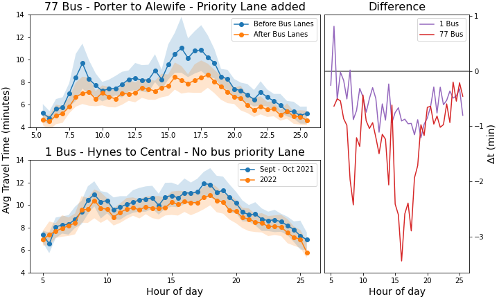

# mbta-analysis

<!--  -->
<!--  -->
<!--  -->
<!--  -->
<!--  -->

## What
Some basic python tools for analyzing mbta historical data.

See the [examples](examples) folder for basic usage such as how to make this comparison to see the effect of the Mass Ave Bus priority lanes on the 77 bus.
(see the example notebook for more details on how to interpret this figure)

## Why
https://dashboard.transitmatters.org/ is amazing and definitely what you should use for quickly looking at things. But it doesn't allow easy comparison of different dates or different lines. For example take a look at the [twitter thread](https://twitter.com/PetruSofio/status/1508555535360180230) that motivated the creation of this. So this library ingests mbta data and does some reasonable pandas transforms

## Improvements

There are undoubtedly many ways to improve this. I'm no pandas professional, in fact I had never used a `groupby` before starting this. All of which is to say: PRs and suggestions welcome :smile:

## Data
I downloaded the data using the scripts here: https://github.com/transitmatters/t-performance-dash/tree/10698c5e1b102521f8f6f66764ccaf13873a0bb7/server/bus
